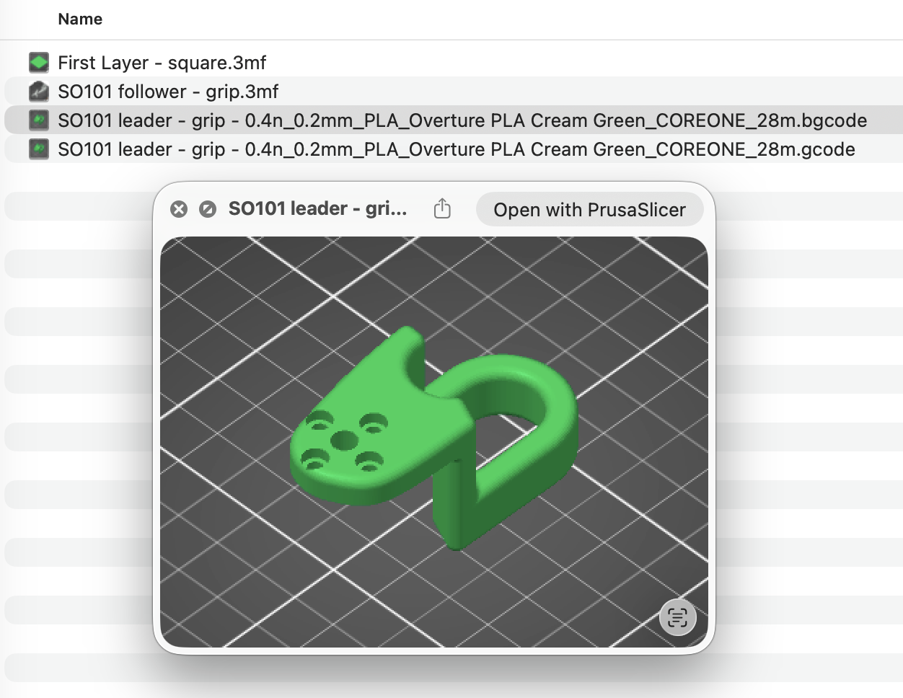

# Slicer Companion for macOS

Modern Quick Look extensions to preview 3D printing slicer files in Finder.

Supports:
- **3MF** files (`.3mf`) - ZIP-based 3D manufacturing format
- **GCode** files (`.gcode`, `.gco`) - PrusaSlicer with embedded thumbnails
- **BGCode** files (`.bgcode`) - Binary GCode format from Prusa

The extensions extract and display embedded thumbnails from these files:
- Quick Look preview (press Space) shows the embedded thumbnail
- Finder thumbnails use the same embedded image

---

## Preview Example



---

## Supported Formats

### 3MF Files
3MF is a ZIP-based archive format for 3D manufacturing. Thumbnails are stored in:
- `/Metadata/thumbnail.png` or `/Metadata/thumbnail.jpeg`

Most slicers (PrusaSlicer, Cura, etc.) embed thumbnails automatically when exporting 3MF files.

### GCode Files
PrusaSlicer embeds thumbnails as base64-encoded PNG images in GCode comments:
```gcode
; thumbnail begin 300x300 12345
; <base64 encoded PNG data>
; thumbnail end
```

Enable thumbnails in PrusaSlicer: Printer Settings > General > G-code thumbnails.

### BGCode Files (Binary GCode)
BGCode is Prusa's binary GCode format, supported by newer Prusa printers (MK4, XL).
Thumbnails are embedded in binary blocks and may use:
- PNG format
- JPEG format
- QOI format (Quite OK Image)

With optional Heatshrink or Deflate compression.

---

## Build & Install

1. Open the project in Xcode.
2. Select the `Slicer Companion` target and build/run (Cmd+R) to test.
3. To install for all users:
   - Archive (Product > Archive), export the app, and move it to `/Applications`.
4. Launch the app once to register the extensions.
5. If thumbnails or previews do not appear, refresh Quick Look:

```bash
qlmanage -r
killall Finder
```

---

## Enable the Extensions

Open System Settings > Privacy & Security > Extensions > Quick Look and enable
`Slicer Companion`.


---

## How It Works

The extension detects the file type by extension and extracts thumbnails accordingly:

| Format | Structure | Thumbnail Location |
|--------|-----------|-------------------|
| 3MF | ZIP archive | `/Metadata/thumbnail.png` |
| GCode | Plain text | Base64 between `; thumbnail begin/end` |
| BGCode | Binary blocks | Block type 5 (thumbnail) |

No 3D model parsing is performed - only embedded thumbnails are extracted.

---

## Troubleshooting

- **Extensions not working**: Ensure `Slicer Companion` is enabled in System Settings > Extensions > Quick Look
- **No thumbnails**: Run `qlmanage -r` to reload Quick Look plugins
- **3MF files**: Verify your slicer is configured to embed thumbnails
- **GCode files**: Enable "G-code thumbnails" in PrusaSlicer printer settings
- **BGCode files**: Thumbnails are embedded by default in PrusaSlicer 2.6+

---

## Technical Details

This project uses pure Swift with no external dependencies:
- ZIP parsing for 3MF files
- Text/Base64 parsing for GCode files
- Binary block parsing for BGCode files
- Heatshrink decompression (pure Swift implementation)
- QOI image decoding (pure Swift implementation)

---

## License

Licensed under MIT - see `LICENSE`.
